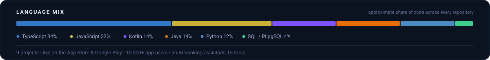

<!--
  Ahmad Hassan (@Ahmadhsn1) — AI Systems Engineer · Full-Stack Developer · Native Android.
  LLM products end to end: RAG pipelines, agents, agentic workflows, multi-tenant SaaS,
  secure API design, Postgres Row Level Security, LLM cost & reliability engineering.
  MERN · Next.js · Python / Flask · Kotlin · Java · React Native.
  Co-lead developer (one of two) on EasyQuran — a Quran study app built with a Saudi team,
  live on the App Store and Google Play. Aria — an AI booking assistant at Prime Coworking:
  LLM tool-calling over a production scheduling platform, OTP-gated mutations, audit trail.
  Lahore, Pakistan. Panels are generated SVGs in /assets/x.
-->

 

  

 

## 🧭 Profile

> **"The gap between a notebook that calls a model and a product people pay for — I engineer that gap."**

I build **applied AI systems** that survive contact with real users. Most LLM work stops at *"it calls the model and it runs on my machine."* Mine is designed for the parts that break in production — per-user token budgets so one account can't run up the bill, graceful degradation when the model returns garbage or times out, signed short-lived asset URLs, and a test suite built around the invariants the security model actually rests on.

I own products **end to end**: data model, API, auth, the web client, the Android app, CI and the deploy — no handoffs for something to fall through. Most recently as **co-lead developer on [EasyQuran](https://easyquran.app)**, a Quran study app built with a Saudi team and shipped to the App Store and Google Play, now used by 10,000+ families at 4.9★. At **Prime Coworking** I built **Aria**, a conversational booking assistant layered over the company's scheduling platform — 15 tools over the existing domain services, an emailed OTP on every booking change, and an audit-log entry for each write.

<table>
<tr><td>⚡&nbsp;<b>Edge</b></td><td>Taking working prototypes to production — revocation-aware sessions, tenant isolation enforced in the database, cost controls on metered AI, and deploys that actually happen</td></tr>
<tr><td>🌐&nbsp;<b>Web</b></td><td><b>MERN</b> &amp; <b>Next.js</b> — REST APIs, auth &amp; sessions, Postgres Row Level Security, React Server Components, real-time over WebSockets / SSE</td></tr>
<tr><td>📱&nbsp;<b>Mobile</b></td><td>Native <b>Android</b> in <b>Kotlin</b> &amp; <b>Java</b> — Material 3, offline-first sync, biometric &amp; encrypted storage, CI-built release APKs, published to Google Play</td></tr>
<tr><td>🤖&nbsp;<b>AI</b></td><td><b>Python / Flask</b> &amp; <b>NestJS</b> — RAG pipelines, tool-calling assistants over live production services, decision engines, background schedulers, structured &amp; streamed output, prompt-cost &amp; reliability engineering</td></tr>
<tr><td>🤝&nbsp;<b>Teams</b></td><td>Co-lead developer (one of two) on a Saudi engineering team, alongside dedicated QA, content and marketing teams</td></tr>
<tr><td>📍&nbsp;<b>Based in</b></td><td>Lahore, Pakistan — open to remote</td></tr>
</table>

 

## 🗂️ Selected Work

Nine projects — an AI booking layer for a commercial scheduling platform at Prime Coworking, one app live on the App Store &amp; Google Play, and the rest open-source with every number pulled straight from the repo.

<table>
<tr><th align="left">Project</th><th align="left">What it is</th><th align="left">Signals</th></tr>

<tr>
<td><b>Aria</b> AI Booking Assistant · at Prime Coworking</td>
<td>A conversational booking layer built at <b>Prime Coworking</b>, sitting on top of the company's existing scheduling platform. Customers chat in any language — <i>&ldquo;need an appointment tomorrow after 5&rdquo;</i> — and Aria resolves the service and staff, offers <b>real</b> open slots, and books, reschedules or cancels. The rule that holds it together: Aria owns <b>no</b> availability or booking logic — the booking engine stays the single source of truth and Aria is a pure orchestration layer, so the assistant and the traditional booking widget can never drift apart.</td>
<td><code>NestJS · TypeScript</code> <code>15 tool-calling functions</code> <code>MongoDB conversation memory</code> <code>Gemini 2.5 Flash</code> <code>OTP-gated + audit-logged mutations</code> <code>provider-neutral LLM layer</code> One public endpoint, throttled per IP · every tool wraps a domain service the production widget already calls — zero duplicated booking logic · 40-message bounded history with orphan-turn protection · 4-attempt retry with backoff · React 19 iframe chat widget — focus-trap a11y, abort-on-unmount, server-owned state</td>
</tr>

<tr>
<td><a href="https://easyquran.app"><b>EasyQuran</b></a> <a href="https://apps.apple.com/pk/app/easy-quran-urdu-and-english/id6759831556">App&nbsp;Store&nbsp;↗</a> · <a href="https://play.google.com/store/apps/details?id=com.ahmadshahwaiz.easyquran">Google&nbsp;Play&nbsp;↗</a></td>
<td><b>Co-lead developer</b> (one of two), frontend + backend. A native Quran study app for Muslim families — the full text with 11+ translations, verse-by-verse recitation with repeat mode, tafseer from Ibn Kathir &amp; Maududi, topic-based browsing, and daily reading goals with streak tracking. Works fully offline after first download; scholar-certified; completely ad-free.</td>
<td><code>Kotlin</code> <code>Native Android</code> <code>iOS · Android · Web</code> <code>10,000+ families</code> <code>4.9★ Google Play</code> <code>11+ translations</code> <code>offline-first</code> Kotlin client + REST backend · offline sync engine · audio streaming · App Store + Play Store release pipeline · built with a Saudi team (QA · content · marketing)</td>
</tr>

<tr>
<td><a href="https://github.com/Ahmadhsn1/retailflow-saas"><b>RetailFlow</b></a> <a href="https://shop-management-liard.vercel.app">live&nbsp;demo&nbsp;↗</a></td>
<td>A multi-tenant retail SaaS for South Asian shops — barcode billing, weighted-average costing, <i>khata</i> credit ledgers and shift reconciliation. Every tenant is isolated by Postgres Row Level Security; every rupee is stored as an integer and the cash drawer reconciles to the paisa.</td>
<td><code>35 tables</code> <code>92 migrations</code> <code>41 RPCs</code> <code>56 API routes</code> <code>231 tests</code> <code>22 permissions</code> Next.js 15 · React 19 Server Components · TypeScript (strict) · Supabase Postgres + RLS · Tailwind v4 · shadcn/ui</td>
</tr>

<tr>
<td><a href="https://github.com/Ahmadhsn1/notemind-app"><b>NoteMind</b></a></td>
<td>An AI knowledge platform built to production standards, not tutorial standards. Semantic search and <b>cited</b> natural-language Q&amp;A over your whole note graph, SM-2 flashcards generated from raw notes, and a live force-directed graph of how notes connect.</td>
<td><code>159 tests</code> <code>0 vulnerabilities</code> <code>79 API routes</code> <code>9 collections</code> <code>Google Gemini</code> Session re-verified against the DB every request · HMAC-signed 1-hour asset URLs · per-user AI quotas · suite validated by re-introducing real shipped bugs · React 19 · Express 5 · MongoDB · Vitest</td>
</tr>

<tr>
<td><a href="https://github.com/Ahmadhsn1/fitmind-ai"><b>FitMind AI</b></a></td>
<td>AI fitness coaching that re-plans itself around the user. A Flask backend runs eight decision engines — adaptive weekly programming, a form-efficiency engine that corrects logged calories by rep quality, a TDEE- and budget-aligned diet engine, a linear-regression goal predictor, and a recovery engine that redistributes missed sessions — with nightly schedulers regenerating plans and reports.</td>
<td><code>Flask + SQLAlchemy</code> <code>MySQL · 13 tables</code> <code>43 endpoints</code> <code>8 decision engines</code> <code>APScheduler</code> <code>10/10 integration tests</code> Python 3.11 · JWT auth · Firebase Cloud Messaging · Kotlin / Jetpack Compose client</td>
</tr>

<tr>
<td><a href="https://github.com/Ahmadhsn1/copper-larder"><b>The Copper Larder</b></a></td>
<td>A streaming AI host ("Hannah") embedded as a widget on a restaurant's site — answers menu and booking questions in the venue's voice and captures callback leads. The request pipeline is the interesting part: rate-limit caps → complaint detection → scripted intercepts → response cache → Gemini, so most requests never reach the model.</td>
<td><code>Gemini 2.0 Flash</code> <code>streamed over SSE</code> <code>Supabase Postgres · RLS</code> <code>caps → detect → cache → LLM</code> Next.js 16 · React 19 · TypeScript · Tailwind v4 · @google/genai · service-role-only Supabase access</td>
</tr>

<tr>
<td><a href="https://github.com/Ahmadhsn1/MindScribe-android-app"><b>MindScribe</b></a> <a href="https://github.com/Ahmadhsn1/MindScribe-android-app/releases/latest">download&nbsp;APK&nbsp;↗</a></td>
<td>Privacy-first Android journaling, built on one conviction: what people write about their own lives is sensitive data. The journal locks independently of the phone, writing never blocks on the network, and journaling is guided rather than blank-page.</td>
<td><code>Java 8</code> <code>Material 3</code> <code>25 classes / 3,857 LOC</code> <code>PIN: salted SHA-256, never stored</code> EncryptedSharedPreferences · WorkManager uploads survive process death and reboot · instant Firestore local-cache writes · client-side streak + mood analytics</td>
</tr>

<tr>
<td><a href="https://github.com/Ahmadhsn1/SpendSmart"><b>SpendSmart</b></a></td>
<td>A real-time Android expense tracker with <b>no backend server</b> — the app talks to Cloud Firestore directly over an authenticated channel, so every edit lands on every signed-in device before the keyboard closes.</td>
<td><code>Java 8</code> <code>minSdk 24</code> <code>0 backend servers</code> <code>live snapshot sync</code> <code>Android CI</code> <code>firestore.rules</code> <i>is</i> the authorization layer — a deny-by-default whitelist of schema-validated writes and owner-only reads · a patched APK can't read another user's data or store a negative amount</td>
</tr>

<tr>
<td><a href="https://github.com/Ahmadhsn1/fittrack-gym-management"><b>FitTrack</b></a></td>
<td>A production gym admin dashboard — members, memberships, attendance, trainers, payments — built as a single-page React app with a hand-authored design-token system and <b>not one UI dependency</b>.</td>
<td><code>React 19.2</code> <code>Vite 8.2</code> <code>0 UI dependencies</code> <code>194 kB gzipped</code> <code>8 routes · full CRUD</code> Dual-theme design tokens authored from scratch · KPIs and revenue roll-ups all derived, none hardcoded · CI</td>
</tr>

</table>

 

## 🔬 Engineering Notes

A few decisions from the work above that I'd defend in a review:

- **Money is never a float.** RetailFlow stores every amount as an integer and reconciles the cash drawer to the paisa before anyone goes home.
- **The test suite is validated, not assumed.** NoteMind's suite was proven by re-introducing real, previously-shipped bugs one at a time and confirming each one is caught.
- **The database is the security boundary.** SpendSmart ships with no server — `firestore.rules` is a deny-by-default whitelist. RetailFlow's tenants are isolated by Row Level Security, not by a `WHERE` clause someone might forget.
- **The model is the last resort, not the first.** The Copper Larder answers caps, complaints and common questions from scripted intercepts and a cache; Gemini only ever sees what none of those could handle.
- **Offline is a feature, not a fallback.** MindScribe hands uploads to WorkManager so they finish after a reboot; EasyQuran works fully offline after the first download.
- **Revocation is instant.** NoteMind re-verifies the session against the database on every request — a revoked user is locked out now, not in fifteen minutes.
- **A public endpoint still needs teeth.** Aria's booking API is unauthenticated by design, so every booking change is gated behind an emailed OTP (with a name-and-phone-match fallback), rate-limited per IP, locked after repeated bad attempts and written to an audit log — and the prompt's integrity block means a customer can't talk their way past any of it.
- **The model orchestrates; it never owns the truth.** Each of Aria's 15 tools wraps the exact domain service the production booking widget already calls, so there is no second copy of the availability logic for the AI to disagree with.

 

## 🧰 Tech Stack

What I reach for, and what I've shipped with.

**🤖 AI &amp; Data**

`Google Gemini` `OpenAI` `LangChain` `RAG pipelines` `Function / tool calling` `Vector search & embeddings` `Structured & streamed output` `Prompt-cost & reliability engineering` `Pandas`

**🌐 Frontend**

`React 19` `Next.js 15 / 16` `React Server Components` `TypeScript (strict)` `Tiptap` `shadcn/ui` `d3-force`

**🔧 Backend**

`Node.js` `NestJS` `Express 5` `Flask` `REST APIs` `LLM tool-calling loops` `Server-Sent Events` `Socket.IO` `Zod` `JWT` `APScheduler`

**🗄️ Databases**

`PostgreSQL` `Supabase` `Row Level Security` `MongoDB / Mongoose` `Cloud Firestore` `MySQL` `Redis`

**📱 Mobile**

`Kotlin` `Java` `Jetpack Compose` `Material Design 3` `WorkManager` `EncryptedSharedPreferences` `React Native`

**⚙️ DevOps &amp; Tooling**

`Git` `GitHub Actions` `Docker` `Vercel` `Cloudflare R2` `Vitest` `Supertest` `in-memory MongoDB (tests)`

 

## 📊 By the Numbers

 

## ⚙️ How I Build

- **Validate at the boundary.** Every write goes through a schema; bad input never reaches business logic.
- **Fail fast, at boot.** Misconfiguration should kill the process at startup with a readable error — not surface as a 500 next Tuesday.
- **Assume the model misbehaves.** Rate limits, quotas, timeouts, caches and fallbacks are part of the feature, not a follow-up ticket.
- **Isolate tenants in the database.** Authorization in application code is a suggestion; enforced by Row Level Security it is a guarantee.
- **Tests are how I move fast.** They aren't bureaucracy — they're what lets me refactor auth without fear.
- **Own the whole path.** Schema to store listing. If there's a handoff, something falls through it.
- **Ship it.** Code that isn't deployed doesn't count.

 

 

